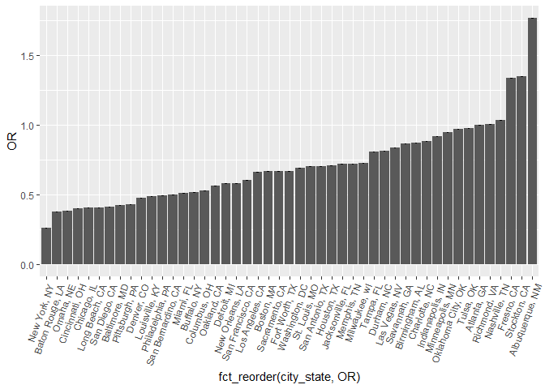
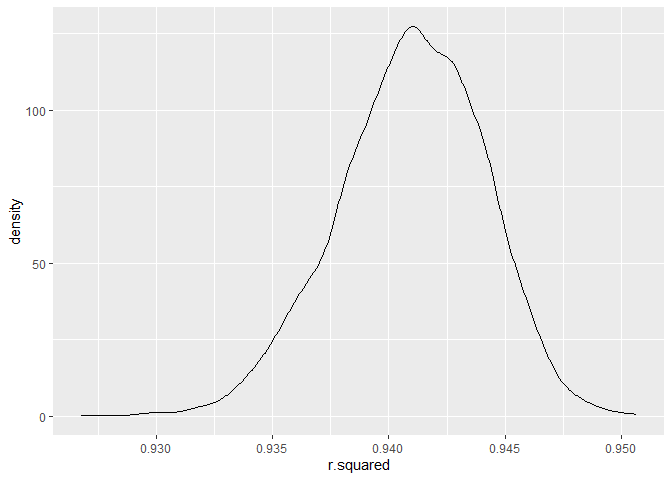
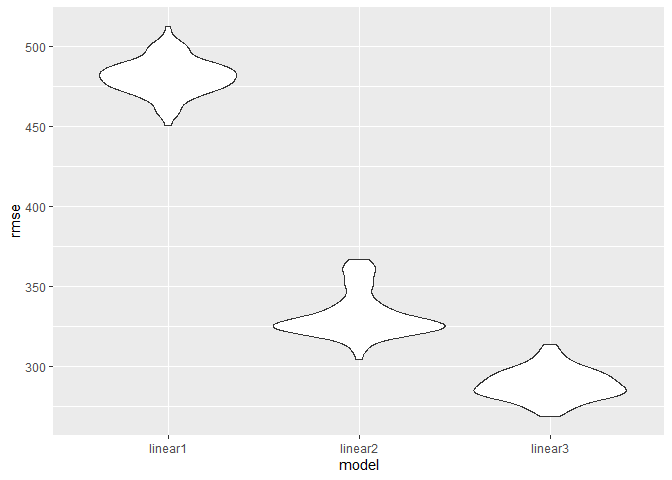

p8015_hw6_dmb2257
================
Diane Benites
2025-11-24

``` r
library(tidyverse)
```

    ## ── Attaching core tidyverse packages ──────────────────────── tidyverse 2.0.0 ──
    ## ✔ dplyr     1.1.4     ✔ readr     2.1.5
    ## ✔ forcats   1.0.0     ✔ stringr   1.5.2
    ## ✔ ggplot2   3.5.2     ✔ tibble    3.3.0
    ## ✔ lubridate 1.9.4     ✔ tidyr     1.3.1
    ## ✔ purrr     1.1.0     
    ## ── Conflicts ────────────────────────────────────────── tidyverse_conflicts() ──
    ## ✖ dplyr::filter() masks stats::filter()
    ## ✖ dplyr::lag()    masks stats::lag()
    ## ℹ Use the conflicted package (<http://conflicted.r-lib.org/>) to force all conflicts to become errors

``` r
library(p8105.datasets)
library(modelr)
library(mgcv)
```

    ## Loading required package: nlme
    ## 
    ## Attaching package: 'nlme'
    ## 
    ## The following object is masked from 'package:dplyr':
    ## 
    ##     collapse
    ## 
    ## This is mgcv 1.9-3. For overview type 'help("mgcv-package")'.

``` r
data("weather_df")
set.seed(1)
```

# Problem 1

This code chunk imports and cleans the homicide dataset. It creates a
city_state variable and a solved variable (to indicate true if the
homicide was solved). The cities without victim race and Tulsa, Al were
omitted. The data was also filtered to only include those with
victim_race Black or White. Victim_age was changed from character to
numeric.

``` r
homicide_df = 
  read_csv("homicide-data.csv")|>
  janitor::clean_names()|>
  unite("city_state", city, state, sep = ", ")|>
  mutate(
    city_state = fct_infreq(city_state))|>
  filter(!(city_state %in% c("Tulsa, AL", "Dallas, TX", "Phoenix, AZ", "Kansas City, MO")))|>
  filter((victim_race %in% c("White", "Black")))|>
  filter((victim_sex %in% c("Female", "Male")))|>
  
  mutate(
    resolved = as.numeric(disposition == "Closed by arrest"),
    victim_age = as.numeric(victim_age),
    victim_race = fct_relevel(victim_race, "White"))
```

    ## Rows: 52179 Columns: 12
    ## ── Column specification ────────────────────────────────────────────────────────
    ## Delimiter: ","
    ## chr (9): uid, victim_last, victim_first, victim_race, victim_age, victim_sex...
    ## dbl (3): reported_date, lat, lon
    ## 
    ## ℹ Use `spec()` to retrieve the full column specification for this data.
    ## ℹ Specify the column types or set `show_col_types = FALSE` to quiet this message.

    ## Warning: There was 1 warning in `mutate()`.
    ## ℹ In argument: `victim_age = as.numeric(victim_age)`.
    ## Caused by warning:
    ## ! NAs introduced by coercion

This code chunk uses the glm function to fit a logistic regression with
resolved vs unresolved as the outcome and victim age, sex, and race as
the predictors.

``` r
baltimore_df =
  homicide_df|>
  select(city_state, resolved, victim_age, victim_race, victim_sex)|>
  filter(city_state %in% c("Baltimore, MD"))

fit_baltimore= 
baltimore_df|>
glm(resolved ~ victim_age + victim_race + victim_sex, data = _, family = binomial())

# This obtains the OR for Baltimore
fit_baltimore|>
  broom::tidy()|>
  mutate(OR = exp(estimate))|>
  select(term, OR)|>
  filter(term %in% c("victim_sexMale"))|>
    knitr::kable(digits = 3)
```

| term           |    OR |
|:---------------|------:|
| victim_sexMale | 0.426 |

``` r
fit_baltimore|>
  broom::tidy()|>
  mutate(OR = exp(estimate))|>
  select(term, OR)|>
  filter(term %in% c("victim_sexMale"))|>  
  group_by(term)|>
  summarize(
    ci_lower_or_est = quantile(OR, 0.025),
    ci_upper_or_est = quantile(OR, 0.975))|>
  knitr::kable(digits = 3)
```

| term           | ci_lower_or_est | ci_upper_or_est |
|:---------------|----------------:|----------------:|
| victim_sexMale |           0.426 |           0.426 |

This code chunk uses list columns to fit the logistic regression model
for each city and obtain the OR and CI for each city.

``` r
nested_df <-
  homicide_df|>
  group_by(city_state)%>%
  nest()

nested_results = 
  nested_df |> 
  mutate(
    city_mod = map(data, \(df) glm(resolved ~ victim_age + victim_race + victim_sex, data = df, family = binomial())),
    results = map(city_mod, broom::tidy)) |> 
  select(-data, -city_mod)|>
  unnest(results) |>
  filter(term %in% c("victim_sexMale"))


analysis_results =
nested_results |> 
  group_by(city_state) |> 
  summarize(OR = exp(estimate),
            ci_lower = (quantile(OR, 0.025)), 
            ci_upper = (quantile(OR, 0.975)))
```

This creates a plot that shows the estimated ORs and CIs for each city.

``` r
analysis_results |>
  ggplot(
    aes(fct_reorder(city_state, OR), OR))+
  geom_col()+
  geom_errorbar(aes(ymin = ci_lower, ymax = ci_upper), width = 0.2)+
    theme(axis.text.x = element_text(angle = 70, hjust =1))
```

<!-- -->
Based on the plot, The greatest OR of homicides occurs in
ALbuquerque,NM. The lowest OR occurs in New York, NY.

# Problem 2

This loads and cleans the names of the weather data set.

``` r
weather_df =
weather_df|>
  janitor::clean_names()
```

This code chunk creates a list column and draws 5000 bootstrap samples.

``` r
boot_sample = function(df){
  sample_frac(df, replace = TRUE)
}

boot_straps=
  tibble(strap_number = 1:5000)|>
  mutate(
    strap_sample = map(strap_number, \(i) boot_sample(df = weather_df))
  )

boot_straps
```

    ## # A tibble: 5,000 × 2
    ##    strap_number strap_sample          
    ##           <int> <list>                
    ##  1            1 <spc_tbl_ [2,190 × 6]>
    ##  2            2 <spc_tbl_ [2,190 × 6]>
    ##  3            3 <spc_tbl_ [2,190 × 6]>
    ##  4            4 <spc_tbl_ [2,190 × 6]>
    ##  5            5 <spc_tbl_ [2,190 × 6]>
    ##  6            6 <spc_tbl_ [2,190 × 6]>
    ##  7            7 <spc_tbl_ [2,190 × 6]>
    ##  8            8 <spc_tbl_ [2,190 × 6]>
    ##  9            9 <spc_tbl_ [2,190 × 6]>
    ## 10           10 <spc_tbl_ [2,190 × 6]>
    ## # ℹ 4,990 more rows

This code chunk obtains runs the simple linear regression model for all
of the samples with tmax as the response and tmin and prcp as the
predictors. It then uses broom::glance to extract r.squared and
broom::tidy to obtain B1(tmin) and B2(prcp). The data is then unnested
and only the necessary columns are selected. A new variable (beta_est)
is created, which is the value from computing B1/B2.

``` r
#This computes the r.squared estimate for each bootstrap sample
bootstrap_rsq= 
  boot_straps |>
  mutate(
    models = map(strap_sample, \(df) lm(tmax ~ tmin + prcp, data = df)),
    rsq_results = map(models, broom::glance))|>
  select(-strap_sample, -models) |> 
  unnest(rsq_results) 

# This computes the B1/B2 estimate (beta_ratio) for each bootstrap sample
bootstrap_beta= 
  boot_straps |>
  mutate(
    models = map(strap_sample, \(df) lm(tmax ~ tmin + prcp, data = df)),
    beta_results = map(models, broom::tidy))|>
  select(-strap_sample, -models) |> 
  unnest(beta_results)|>
  filter((term %in% c("tmin", "prcp")))|>
  select(strap_number, term, estimate)|>
  pivot_wider(
    names_from= term,
    values_from = estimate)|>
  mutate(beta_ratio = tmin/prcp)
```

This code chunk plots the distribution of the r.squared estimate

``` r
bootstrap_rsq|>
  ggplot(aes(x = r.squared)) + geom_density()
```

<!-- -->
The r.squared estimates appear to have a bell-curved distribution. The
lowest densities occurs near the lowest and greatest r.squared values.

This code chunk plots the distribution of the b1/b2 estimate.

``` r
bootstrap_beta|>
  ggplot(aes(x = beta_ratio)) + geom_density()
```

<!-- -->
The distribution has a heavy tail towards the lower values of
beta_ratio. The greatest density occurs when the beta ratio is
approximately -275.

This code chunk identifies the 2.5% and 97.5% quantiles to provide a 95%
confidence interval for r.squared and b1/b2. For the r.squared estimate,
the 95% confidence interval is (0.9344391, 0.946677). For the beta
ratio, the 95% confidence interval is (-280.7735,-124.1262).

``` r
bootstrap_rsq |>
  mutate(estimate = "r.squared")|>
  group_by(estimate)|>
  summarize(
    ci_lower_rsq_est = quantile(r.squared, 0.025),
    ci_upper_rsq_est = quantile(r.squared, 0.975))|>
  knitr::kable()
```

| estimate  | ci_lower_rsq_est | ci_upper_rsq_est |
|:----------|-----------------:|-----------------:|
| r.squared |        0.9343767 |        0.9466277 |

``` r
bootstrap_beta |>
  mutate(estimate = "beta_ratio")|>
  group_by(estimate)|>
  summarize(
    ci_lower_beta = quantile(beta_ratio, 0.025),
    ci_upper_beta = quantile(beta_ratio, 0.975))|>
  knitr::kable()
```

| estimate   | ci_lower_beta | ci_upper_beta |
|:-----------|--------------:|--------------:|
| beta_ratio |     -279.7489 |     -125.6859 |

# Problem 3

This imports the dataset.

``` r
birthweight_df = read.csv(file = "p8105_hw6_dmb2257_files/birthweight.csv")
```

This cleans the dataset, renaming the values for categorical variables
and changing the numeric values from integers to numeric.

``` r
bwtidy_df=
  birthweight_df|>
  janitor::clean_names()|>
  mutate(
    babysex = case_match(
      babysex,
      1 ~ "male",
      2 ~ "female"),
    frace = case_match(
      frace,
      1 ~ "white",
      2 ~ "black",
      3 ~ "asian",
      4 ~ "puerto rican",
      8 ~ "other",
      9 ~ "unknown"),
    mrace = case_match(
      mrace,
      1 ~ "white",
      2 ~ "black",
      3 ~ "asian",
      4 ~ "puerto rican",
      8 ~ "other"), 
    malform = case_match(
      malform,
      0 ~ "absent",
      1 ~ "present"),
    bhead = as.numeric(bhead),
    blength = as.numeric(blength),
    bwt = as.numeric(bwt),
    delwt = as.numeric(delwt),
    fincome = as.numeric(fincome),
    menarche = as.numeric(menarche),
    mheight = as.numeric(mheight),
    momage = as.numeric(momage),
    parity = as.numeric(parity),  
    pnumlbw = as.numeric(pnumlbw),
    pnumsga = as.numeric(pnumsga),
    ppwt = as.numeric(ppwt),
    wtgain = as.numeric(wtgain)
  )|>
  drop_na()
```

This code chunk includes the proposed regression model for birthweight I
will be using. For this proposed model I included variables regarding
the mother’s weight. The hypothesized factors that underly birthweight
included in this model are mother’s weight at delivery, mother’s
pre-pregnancy BMI, mother’s pre-pregnancy weight, and mother’s weight
gain during pregnancy.

``` r
mod1 = lm(bwt ~ delwt + ppbmi + ppwt + wtgain, data = bwtidy_df)
```

This creates a plot of model residuals against fitted values.

``` r
bwtidy_df|> 
add_predictions(mod1)|>
add_residuals(mod1)|>
ggplot(aes(x = pred, y = resid))+
  geom_point()
```

<!-- -->

This creates a model (mod1) using length at birth and gestational age as
predictors

``` r
mod2 = lm(bwt ~ blength + gaweeks, data = bwtidy_df)
```

This creates a model (mod3) using head circumference, length, sex, and
all interactions.

``` r
mod3 = lm(bwt ~ bhead*blength*babysex, data = bwtidy_df)

summary(mod3)
```

    ## 
    ## Call:
    ## lm(formula = bwt ~ bhead * blength * babysex, data = bwtidy_df)
    ## 
    ## Residuals:
    ##      Min       1Q   Median       3Q      Max 
    ## -1132.99  -190.42   -10.33   178.63  2617.96 
    ## 
    ## Coefficients:
    ##                             Estimate Std. Error t value Pr(>|t|)    
    ## (Intercept)                -801.9487  1102.3077  -0.728 0.466948    
    ## bhead                       -16.5975    34.0916  -0.487 0.626388    
    ## blength                     -21.6460    23.3720  -0.926 0.354421    
    ## babysexmale               -6374.8684  1677.7669  -3.800 0.000147 ***
    ## bhead:blength                 3.3244     0.7126   4.666 3.17e-06 ***
    ## bhead:babysexmale           198.3932    51.0917   3.883 0.000105 ***
    ## blength:babysexmale         123.7729    35.1185   3.524 0.000429 ***
    ## bhead:blength:babysexmale    -3.8781     1.0566  -3.670 0.000245 ***
    ## ---
    ## Signif. codes:  0 '***' 0.001 '**' 0.01 '*' 0.05 '.' 0.1 ' ' 1
    ## 
    ## Residual standard error: 287.7 on 4334 degrees of freedom
    ## Multiple R-squared:  0.6849, Adjusted R-squared:  0.6844 
    ## F-statistic:  1346 on 7 and 4334 DF,  p-value: < 2.2e-16

This code chunk compares my model(mod1) to mod2 and mod3.

``` r
cv_df=
  crossv_mc(bwtidy_df, 100)

cv_df |>
  pull(train) |>
  nth(1)|>
  as_tibble()
```

    ## # A tibble: 3,473 × 20
    ##    babysex bhead blength   bwt delwt fincome frace gaweeks malform menarche
    ##    <chr>   <dbl>   <dbl> <dbl> <dbl>   <dbl> <chr>   <dbl> <chr>      <dbl>
    ##  1 female     34      51  3629   177      35 white    39.9 absent        13
    ##  2 female     36      50  3345   148      85 white    39.9 absent        12
    ##  3 male       34      52  3062   157      55 white    40   absent        14
    ##  4 female     34      52  3374   156       5 white    41.6 absent        13
    ##  5 male       33      52  3374   129      55 white    40.7 absent        12
    ##  6 female     33      46  2523   126      96 black    40.3 absent        14
    ##  7 female     33      49  2778   140       5 white    37.4 absent        12
    ##  8 male       36      52  3515   146      85 white    40.3 absent        11
    ##  9 male       33      50  3459   169      75 black    40.7 absent        12
    ## 10 female     35      51  3317   130      55 white    43.4 absent        13
    ## # ℹ 3,463 more rows
    ## # ℹ 10 more variables: mheight <dbl>, momage <dbl>, mrace <chr>, parity <dbl>,
    ## #   pnumlbw <dbl>, pnumsga <dbl>, ppbmi <dbl>, ppwt <dbl>, smoken <dbl>,
    ## #   wtgain <dbl>

``` r
cv_df |>
  pull(test) |>
  nth(1)|>
  as_tibble()
```

    ## # A tibble: 869 × 20
    ##    babysex bhead blength   bwt delwt fincome frace gaweeks malform menarche
    ##    <chr>   <dbl>   <dbl> <dbl> <dbl>   <dbl> <chr>   <dbl> <chr>      <dbl>
    ##  1 male       34      48  3062   156      65 black    25.9 absent        14
    ##  2 male       36      53  3629   147      75 white    41.3 absent        11
    ##  3 male       35      56  3232   147      55 white    42.1 absent        13
    ##  4 female     35      50  3175   140      85 black    40.6 absent        14
    ##  5 female     34      49  3118   161      45 black    38.9 absent        10
    ##  6 male       38      53  3799   167      75 white    39.9 absent        12
    ##  7 female     34      51  3175   142      96 white    42.3 absent        17
    ##  8 female     33      49  3147   140      45 white    40.6 absent        12
    ##  9 male       36      53  3203   140      55 black    39.7 absent        14
    ## 10 female     36      52  4224   178      35 white    41.6 absent        13
    ## # ℹ 859 more rows
    ## # ℹ 10 more variables: mheight <dbl>, momage <dbl>, mrace <chr>, parity <dbl>,
    ## #   pnumlbw <dbl>, pnumsga <dbl>, ppbmi <dbl>, ppwt <dbl>, smoken <dbl>,
    ## #   wtgain <dbl>

``` r
cv_df = 
  cv_df |>
  mutate(
   train = map(train, as_tibble),
   test = map(test, as_tibble))
```

``` r
cv_df = 
  cv_df |>
  mutate(
  linear_mod1 = map(train, \(df) 
        lm(bwt ~ delwt + ppbmi + ppwt + wtgain, data = df)),
  linear_mod2 = map(train, \(df) 
        lm(bwt ~ blength + gaweeks, data = df)),
  linear_mod3 = map(train, \(df) 
         lm(bwt ~ bhead*blength*babysex, data = df)))|>
  
  mutate(
    rmse_linear1 = map2_dbl(linear_mod1, test, \ (mod, df) rmse(model = mod, data = df)),
    rmse_linear2 = map2_dbl(linear_mod2, test, \ (mod, df) rmse(model = mod, data = df)),
    rmse_linear3 = map2_dbl(linear_mod3, test, \ (mod, df) rmse(model = mod, data = df)))
```

``` r
cv_df|>
  select(starts_with("rmse"))|>
  pivot_longer(everything(),
               names_to = "model",
               values_to = "rmse",
               names_prefix = "rmse_")|>
  mutate(model = fct_inorder(model))|>
  ggplot(aes(x =model, y = rmse))+
  geom_violin()
```

<!-- -->

There is a much greater root mean squared errors for the model I
proposed. The model with the lowest RMSE is model3, which includes the
interactions between the predictors, head circumference, length, and
sex. Model 2 also had a lower RMSE than the proposed model, and included
length at birth and gestational age as predictors. Neither of these
models focused on the mother as the proposed model did. Model 3 produced
the lowest RMSE.
