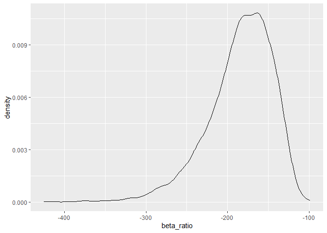
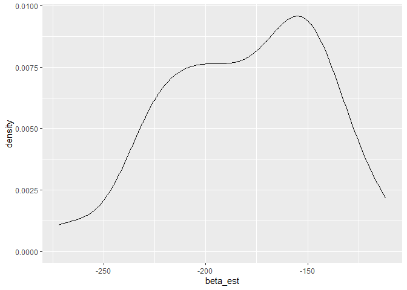
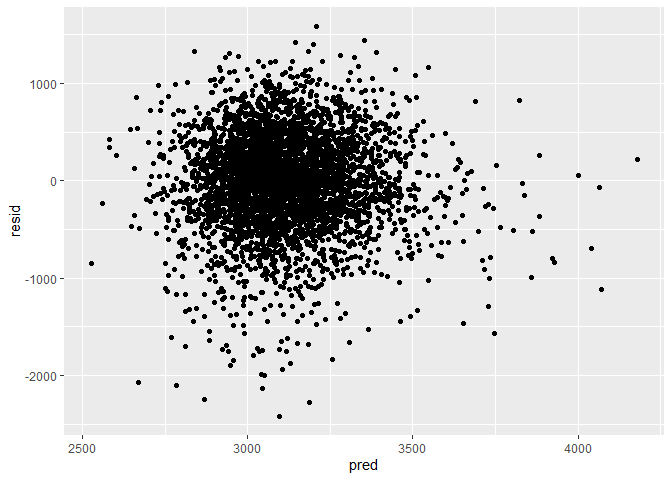

p8015_hw6_dmb2257
================
Diane Benites
2025-11-24

``` r
library(tidyverse)
```

    ## ── Attaching core tidyverse packages ──────────────────────── tidyverse 2.0.0 ──
    ## ✔ dplyr     1.1.4     ✔ readr     2.1.5
    ## ✔ forcats   1.0.0     ✔ stringr   1.5.2
    ## ✔ ggplot2   3.5.2     ✔ tibble    3.3.0
    ## ✔ lubridate 1.9.4     ✔ tidyr     1.3.1
    ## ✔ purrr     1.1.0     
    ## ── Conflicts ────────────────────────────────────────── tidyverse_conflicts() ──
    ## ✖ dplyr::filter() masks stats::filter()
    ## ✖ dplyr::lag()    masks stats::lag()
    ## ℹ Use the conflicted package (<http://conflicted.r-lib.org/>) to force all conflicts to become errors

``` r
library(p8105.datasets)
library(modelr)
library(mgcv)
```

    ## Loading required package: nlme
    ## 
    ## Attaching package: 'nlme'
    ## 
    ## The following object is masked from 'package:dplyr':
    ## 
    ##     collapse
    ## 
    ## This is mgcv 1.9-3. For overview type 'help("mgcv-package")'.

``` r
data("weather_df")
set.seed(1)
```

# Problem 1

This code chunk imports and cleans the homicide dataset. It creates a
city_state variable and a solved variable (to indicate true if the
homicide was solved). The cities without victim race and Tulsa, Al were
omitted. The data was also filtered to only include those with
victim_race Black or White. Victim_age was changed from character to
numeric.

``` r
homicide_df = 
  read_csv("homicide-data.csv")|>
  janitor::clean_names()|>
  unite("city_state", city, state, sep = ", ")|>
  mutate(
    city_state = fct_infreq(city_state))|>
  filter(!(city_state %in% c("Tulsa, AL", "Dallas, TX", "Phoenix, AZ", "Kansas City, MO")))|>
  filter((victim_race %in% c("White", "Black")))|>
  filter((victim_sex %in% c("Female", "Male")))|>
  
  mutate(
    resolved = as.numeric(disposition == "Closed by arrest"),
    victim_age = as.numeric(victim_age),
    victim_race = fct_relevel(victim_race, "White"))
```

    ## Rows: 52179 Columns: 12
    ## ── Column specification ────────────────────────────────────────────────────────
    ## Delimiter: ","
    ## chr (9): uid, victim_last, victim_first, victim_race, victim_age, victim_sex...
    ## dbl (3): reported_date, lat, lon
    ## 
    ## ℹ Use `spec()` to retrieve the full column specification for this data.
    ## ℹ Specify the column types or set `show_col_types = FALSE` to quiet this message.

    ## Warning: There was 1 warning in `mutate()`.
    ## ℹ In argument: `victim_age = as.numeric(victim_age)`.
    ## Caused by warning:
    ## ! NAs introduced by coercion

This code chunk uses the glm function to fit a logistic regression with
resolved vs unresolved as the outcome and victim age, sex, and race as
the predictors.

``` r
baltimore_df =
  homicide_df|>
  select(city_state, resolved, victim_age, victim_race, victim_sex)|>
  filter(city_state %in% c("Baltimore, MD"))

baltimore_glm =
  baltimore_df|>
  glm(resolved ~ victim_age + victim_race + victim_sex, data = _, family = binomial())|>
  broom::tidy()

baltimore_glm|>
  mutate(OR = exp(estimate))|>
  select(term, log_OR = estimate, OR, p.value)|>
  knitr::kable(digits = 3)
```

| term             | log_OR |    OR | p.value |
|:-----------------|-------:|------:|--------:|
| (Intercept)      |  1.152 | 3.164 |   0.000 |
| victim_age       | -0.007 | 0.993 |   0.043 |
| victim_raceBlack | -0.842 | 0.431 |   0.000 |
| victim_sexMale   | -0.854 | 0.426 |   0.000 |

This nests the data by city and creates two functions. The first to
obtain the glm output. The second obtains the adjusted OR and confidence
interval.

``` r
nested_df <-
  homicide_df|>
  group_by(city_state)%>%
  nest()

city_func <-
  function(df) {
      df|>
  glm(resolved ~ victim_age + victim_race + victim_sex, data = _, family = binomial())|>
  broom::tidy()
  }

or_func <-
  function(df){
  df|>
  mutate(OR = exp(estimate))|>
  select(term, log_OR = estimate, OR, p.value)
  }
```

This uses list columns to apply the function to each city in the
dataset.

``` r
listcol_estimates <- 
  map(nested_df$data, city_func)

nested_df2 =
  nested_df %>%
  mutate(list_estimates = map(data, city_func))|>
  select(-data)

listcol_func2<-
  map(nested_df2$list_estimates, or_func)

nested_df3 = 
  nested_df2 %>%
  mutate(list_estimates2 = map(list_estimates, or_func))

tidy_df =
  nested_df3|>
  unnest(list_estimates2)|>
  select(-list_estimates)|>
  filter((term %in% c("victim_sexMale")))
```

This creates a plot that shows the estimated ORs and CIs for each city.

``` r
tidy_df |>
  ggplot(
    aes(fct_reorder(city_state, OR), OR))+
  geom_col()+
    theme(axis.text.x = element_text(angle = 70, hjust =1))
```

<!-- -->

# Problem 2

This loads and cleans the names of the weather data set.

``` r
weather_df =
weather_df|>
  janitor::clean_names()
```

This code chunk creates a list column and draws 5000 bootstrap samples.

``` r
boot_sample = function(df){
  sample_frac(df, replace = TRUE)
}

boot_straps=
  tibble(strap_number = 1:50)|>
  mutate(
    strap_sample = map(strap_number, \(i) boot_sample(df = weather_df))
  )

boot_straps
```

    ## # A tibble: 50 × 2
    ##    strap_number strap_sample          
    ##           <int> <list>                
    ##  1            1 <spc_tbl_ [2,190 × 6]>
    ##  2            2 <spc_tbl_ [2,190 × 6]>
    ##  3            3 <spc_tbl_ [2,190 × 6]>
    ##  4            4 <spc_tbl_ [2,190 × 6]>
    ##  5            5 <spc_tbl_ [2,190 × 6]>
    ##  6            6 <spc_tbl_ [2,190 × 6]>
    ##  7            7 <spc_tbl_ [2,190 × 6]>
    ##  8            8 <spc_tbl_ [2,190 × 6]>
    ##  9            9 <spc_tbl_ [2,190 × 6]>
    ## 10           10 <spc_tbl_ [2,190 × 6]>
    ## # ℹ 40 more rows

This code chunk obtains runs the simple linear regression model for all
of the samples. It then uses broom::glance to extract r.squared and
broom::tidy to obtain B1(tmin) and B2(prcp). The data is then unnested
and only the necessary columns are selected. A new variable (beta_est)
is created, which is the value from computing B1/B2.

``` r
bootstrap_results= 
  boot_straps |>
  mutate(
    models = map(strap_sample, \(df) lm(tmax ~ tmin + prcp, data = df)),
    rsq_results = map(models, broom::glance),
    beta_results = map(models, broom::tidy)) |> 
  select(-strap_sample, -models) |> 
  unnest(rsq_results, beta_results) |>
  select(strap_number, r.squared, term, estimate)|>
  filter((term %in% c("tmin", "prcp")))|>
  pivot_wider(
    names_from= term,
    values_from = estimate)|>
  mutate(beta_est = tmin/prcp)|>
  select(-tmin)|>
  select(-prcp)
```

    ## Warning: `unnest()` has a new interface. See `?unnest` for details.
    ## ℹ Try `df %>% unnest(c(rsq_results, beta_results))`, with `mutate()` if needed.

This code chunk plots the distribution of the r.squared estimate

``` r
bootstrap_results|>
  ggplot(aes(x = r.squared)) + geom_density()
```

<!-- -->
The r.squared estimates appear to have a bell-curved distribution. The
lowest densities occurs at the maximum and minimum r.squared values.

This code chunk plots the distribution of the b1/b2 estimate

``` r
bootstrap_results|>
  ggplot(aes(x = beta_est)) + geom_density()
```

<!-- -->
The distribution of B1/B2 estimates have a tail towards the lower values
of beta_est.

This code chunk identifies the 2.5% and 97.5% quantiles to provide a 95%
confidence interval for r.squared and b1/b2. It then creates a tidy
table of the r.squared and b1/b2 estimates with the respective
confidence intervals, in each sample.

``` r
boostrap_ci=
bootstrap_results |>
  group_by(strap_number)|>
  summarize(
    ci_lower_est = quantile(r.squared, 0.025),
    ci_upper_est = quantile(r.squared, 0.0975),
    ci_lower_beta = quantile(beta_est, 0.025),
    ci_upper_beta = quantile(beta_est, 0.0975))|>
  ungroup()

est_ci_df =
  left_join(boostrap_ci, bootstrap_results, by= "strap_number")|>
  select(strap_number, r.squared, ci_lower_est, ci_upper_est, beta_est, ci_lower_beta, ci_upper_beta)
```

# Problem 3

This imports the dataset.

``` r
data_path <- 
"C:/Users/dmben/OneDrive/Desktop/data_science_1/p8105_hw6_dmb2257/"

birthweight_df = read.csv(file = "p8105_hw6_dmb2257_files/birthweight.csv")
```

This cleans the dataset, renaming the values for categorical variables
and changing the numeric values from integers to numeric.

``` r
bwt_tidy_df=
  birthweight_df|>
  janitor::clean_names()|>
  mutate(
    babysex = case_match(
      babysex,
      1 ~ "male",
      2 ~ "female"),
    frace = case_match(
      frace,
      1 ~ "white",
      2 ~ "black",
      3 ~ "asian",
      4 ~ "puerto rican",
      8 ~ "other",
      9 ~ "unknown"),
    mrace = case_match(
      mrace,
      1 ~ "white",
      2 ~ "black",
      3 ~ "asian",
      4 ~ "puerto rican",
      8 ~ "other"), 
    malform = case_match(
      malform,
      0 ~ "absent",
      1 ~ "present"),
    bhead = as.numeric(bhead),
    blength = as.numeric(blength),
    bwt = as.numeric(bwt),
    delwt = as.numeric(delwt),
    fincome = as.numeric(fincome),
    menarche = as.numeric(menarche),
    mheight = as.numeric(mheight),
    momage = as.numeric(momage),
    parity = as.numeric(parity),  
    pnumlbw = as.numeric(pnumlbw),
    pnumsga = as.numeric(pnumsga),
    ppwt = as.numeric(ppwt),
    wtgain = as.numeric(wtgain)
  )|>
  drop_na()
```

This is the proposed regression model for birthweight I will be using.
The hypothesized structure for the factors that underly birthweight
include delwt, menarche, mheight, momage, mrace, ppbmi, ppwt, smoken ,
wtgain.

``` r
mod1 = lm(bwt ~ delwt + menarche + mheight+ momage + mrace + ppbmi + ppwt+ smoken + wtgain, data = bwt_tidy_df)
```

This creates a plot of model residuals against fitted values.

``` r
resid_df = 
modelr::add_residuals(bwt_tidy_df, mod1)

pred_df =
modelr::add_predictions(bwt_tidy_df, mod1)

res_pred_df = 
  left_join(resid_df, pred_df)
```

    ## Joining with `by = join_by(babysex, bhead, blength, bwt, delwt, fincome, frace,
    ## gaweeks, malform, menarche, mheight, momage, mrace, parity, pnumlbw, pnumsga,
    ## ppbmi, ppwt, smoken, wtgain)`

``` r
res_pred_df|>
  ggplot(aes(x = pred, y = resid))+
  geom_point()
```

<!-- -->

This creates a model using length at birth and gestational age as
predictors

``` r
mod2 = lm(bwt ~ blength + gaweeks, data = bwt_tidy_df)
```

This creates a model using head circumference, length, sex, and all
interactions

``` r
mod3 = lm(bwt ~ bhead*blength*babysex + bhead*blength + blength*babysex + bhead*babysex +bhead +blength +babysex, data = bwt_tidy_df)
```
